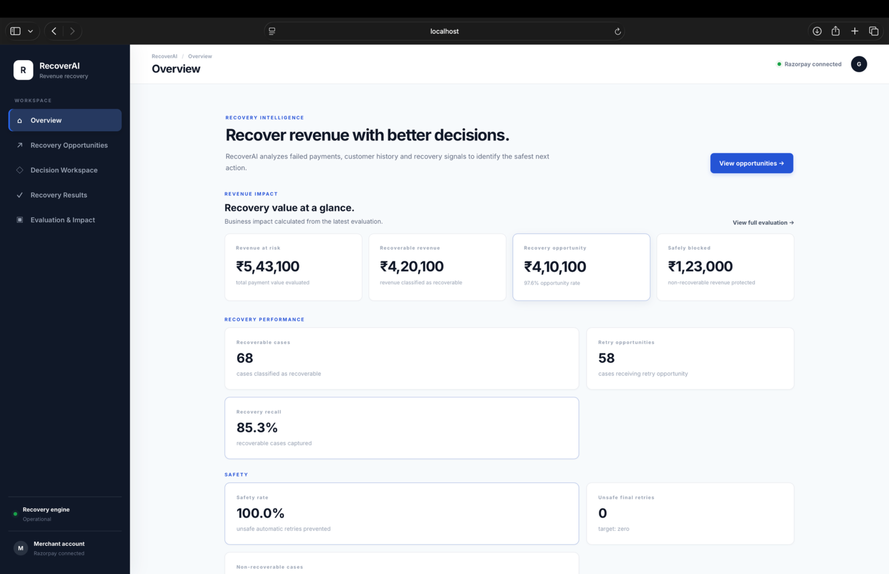
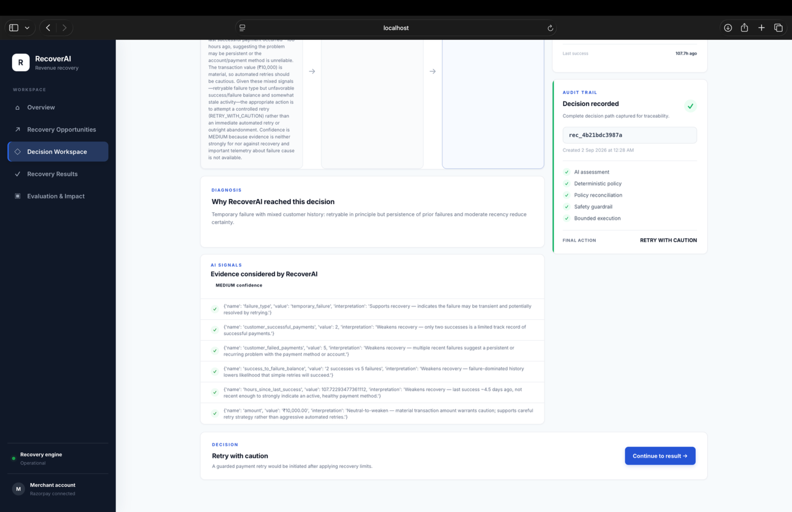
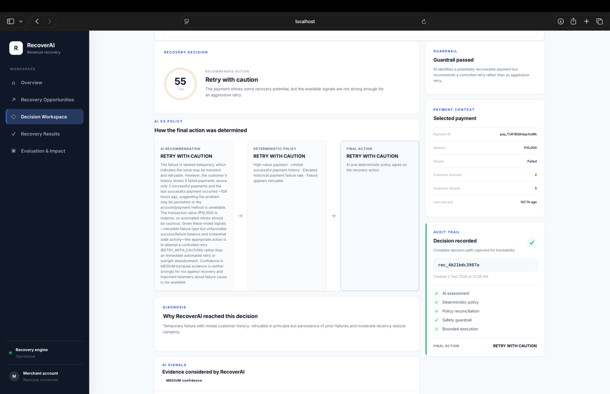
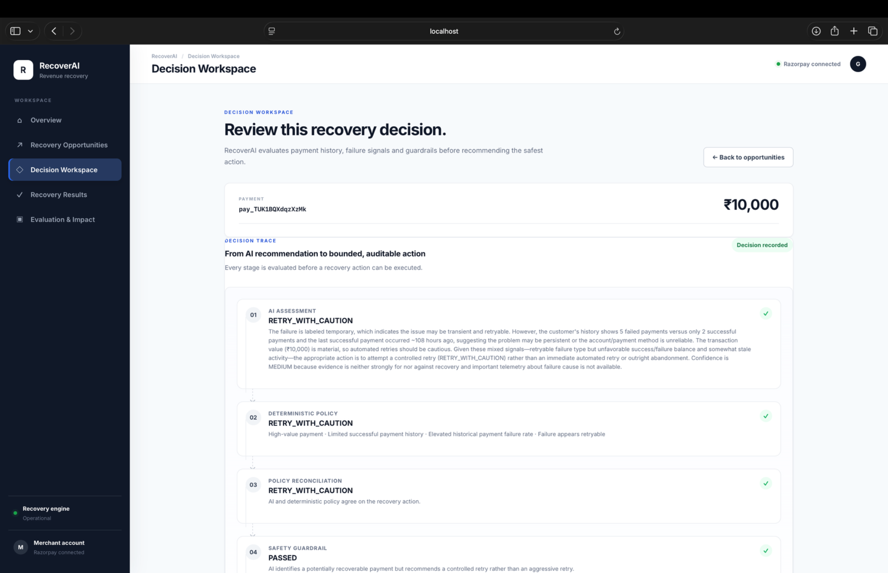
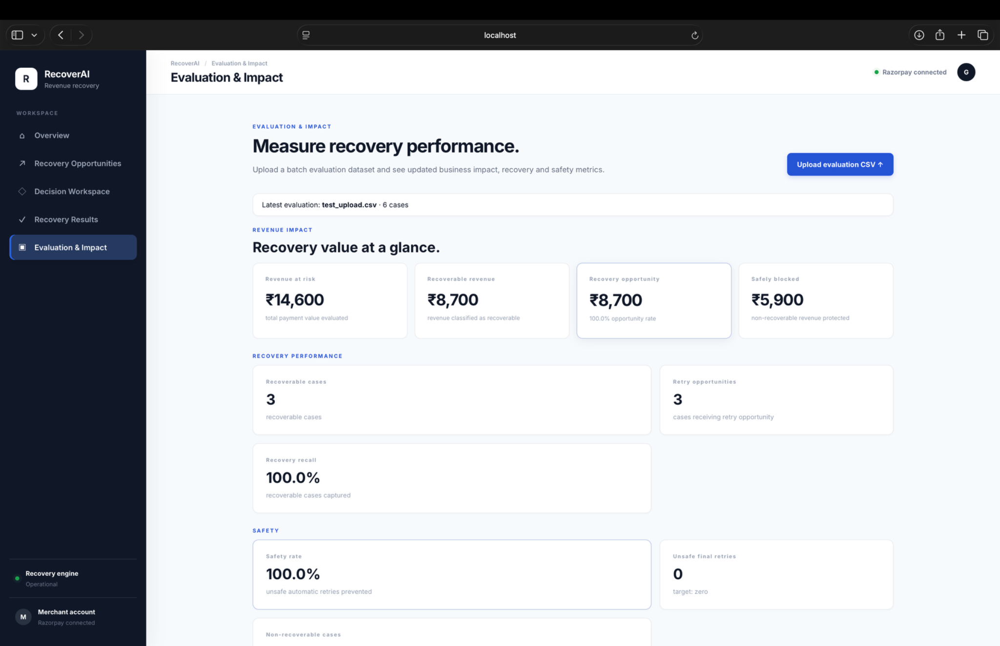
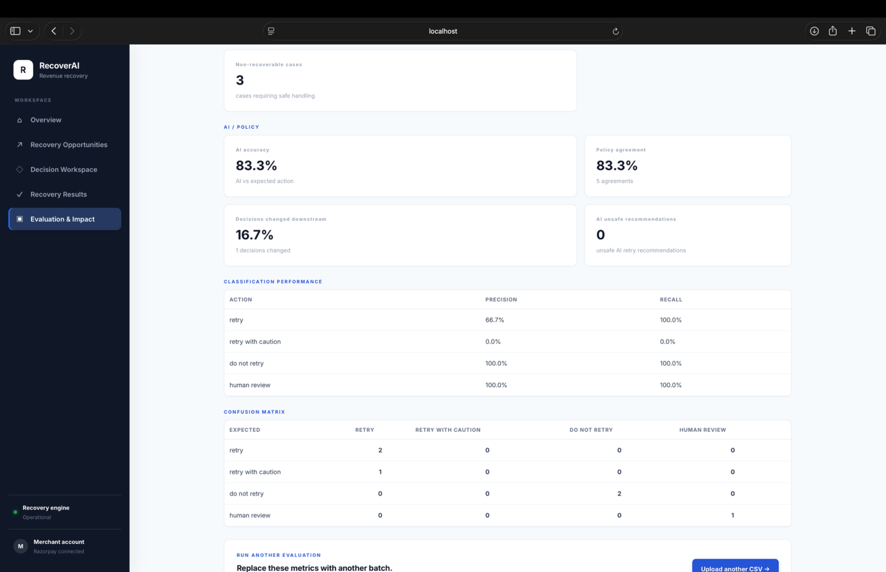

# RecoverAI — AI Revenue Recovery

AI-powered revenue recovery system for merchants — Razorpay AI Buildathon 2026.

## Product

RecoverAI detects revenue at risk, reconstructs payment state, diagnoses the failure context, scores recovery opportunities, recommends a bounded recovery action, applies guardrails, executes the action, and records the outcome.

## Safety principle

> **AI can recommend. It cannot authorize.**

RecoverAI separates probabilistic AI reasoning from deterministic recovery policy and execution. The AI diagnoses the payment and recommends an action, while deterministic policy and guardrails decide whether that action is allowed to proceed.

This creates a bounded recovery workflow with explicit stopping rules, human-review escalation, and an auditable decision path.

## Core loop

**Detect → Diagnose → Decide → Guard → Execute → Audit**

Payment events  
→ State resolution  
→ AI diagnosis  
→ Recovery scoring  
→ Deterministic policy  
→ Guardrails  
→ Bounded execution  
→ Outcome  
→ Audit trail

## Results

RecoverAI was evaluated on 100 synthetic payment-recovery scenarios:

| Metric | Result |
|---|---:|
| Revenue at risk | ₹543.1K |
| Recovery opportunity | ₹410.1K |
| Recoverable cases | 68 |
| Recovery recall | 85.3% |
| Final decision accuracy | 85.0% |
| Safety rate | 100% |
| Unsafe final retries | 0 |

> **Recovery opportunity represents payment value classified as safely recoverable by RecoverAI. It is not a claim of money actually recovered.**

## MVP scope

- Payment-failure recovery
- Payment state verification
- AI-assisted diagnosis and recovery recommendation
- Bounded actions with stopping rules
- Human-review escalation for low-confidence/uncertain cases
- Recovery outcome and audit trail
- Batch evaluation on synthetic payment scenarios
- Merchant recovery dashboard

## Repository structure

```text
frontend/      Merchant dashboard
backend/       API, payment state and recovery services
agent/         AI diagnosis and recommendation logic
data/          Synthetic scenarios and processed evaluation data
evaluation/    Batch evaluation and metrics
docs/          Architecture and product documentation
```

## Status

**Working MVP** — evaluated on 100 synthetic payment-recovery scenarios with batch-level recovery, accuracy, and safety metrics.


## Product Screenshots

### Overview

The merchant overview surfaces revenue at risk, recoverable revenue, recovery opportunity, and safety performance at a glance.

<p align="center">
  
</p>

### Decision Workspace

RecoverAI exposes the full decision path — from AI assessment and deterministic policy to reconciliation, guardrails, bounded execution, and auditability.

<details>
<summary><strong>View decision trace</strong></summary>

<p align="center">
  
</p>

</details>

<details>
<summary><strong>View recovery decision and audit trail</strong></summary>

<p align="center">
  
</p>

</details>

<details>
<summary><strong>View diagnosis and AI signals</strong></summary>

<p align="center">
  
</p>

</details>

### Evaluation & Impact

The evaluation workspace shows batch-level revenue impact, recovery recall, safety, AI/policy behavior, and classification performance.

<details>
<summary><strong>View revenue impact and recovery performance</strong></summary>

<p align="center">
  
</p>

</details>

<details>
<summary><strong>View AI, policy and classification metrics</strong></summary>

<p align="center">
  
</p>

</details>

## Important

All development and demonstrations use synthetic/test data and Razorpay test mode where applicable. No live payment credentials or secrets belong in this repository.
